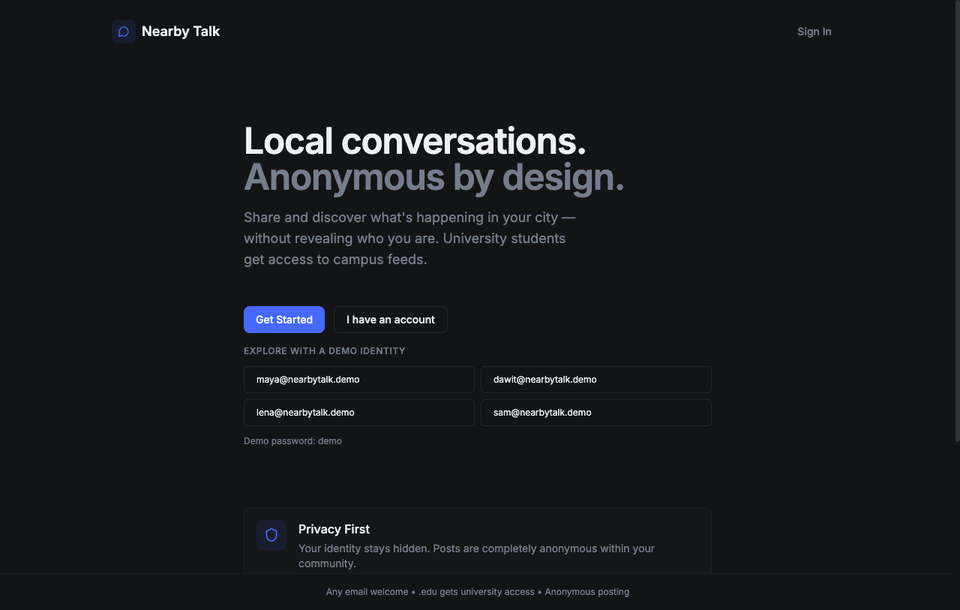
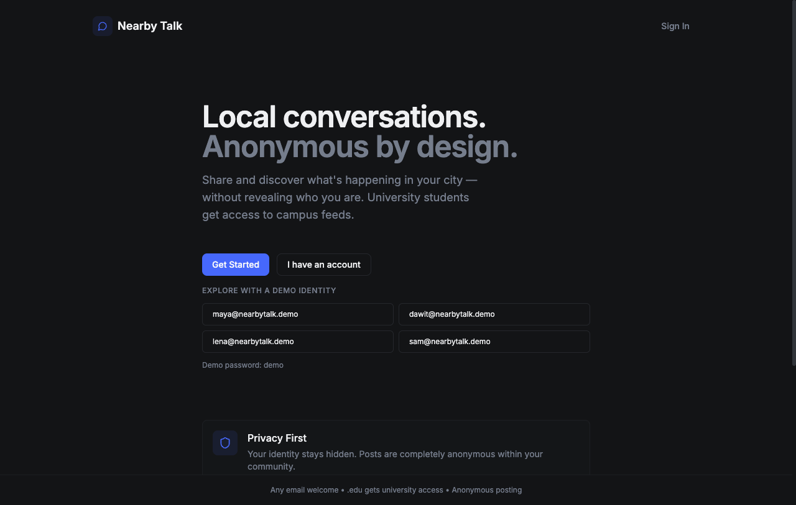
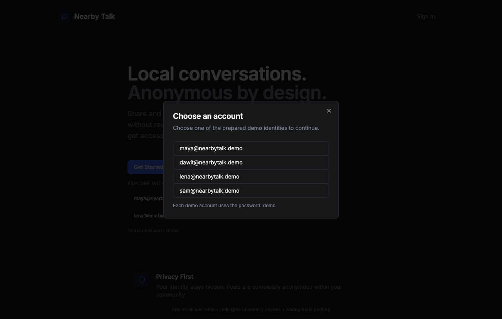
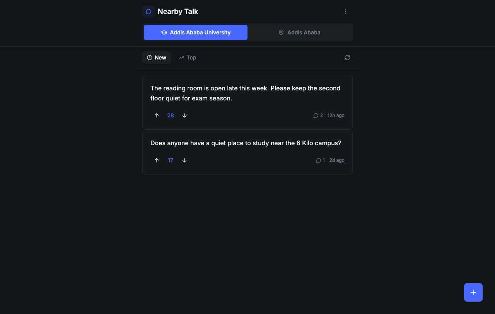
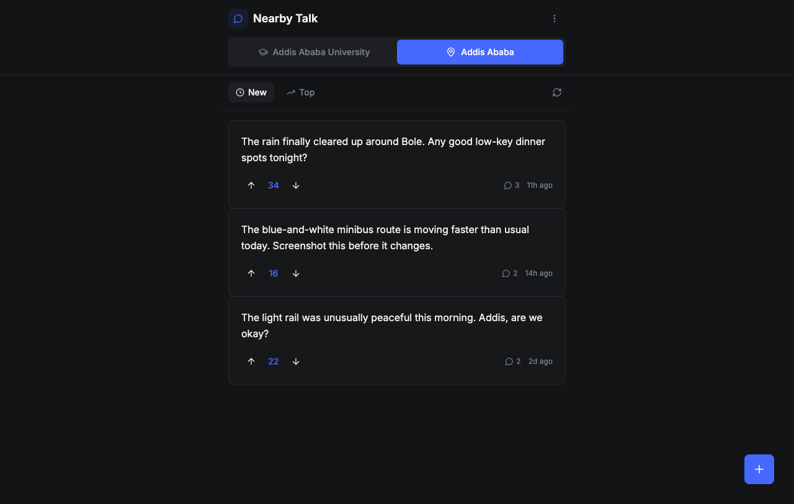

# Nearby Talk

Anonymous local conversations for cities and universities. Nearby Talk lets people post, vote, and comment without attaching a public username to their activity.

## Demo

The app is a full-stack React and FastAPI service with a MongoDB data store. The production stack serves the frontend and API from one origin, so it can run behind a single domain or reverse proxy.



### Screenshots









## Features

- Anonymous city and university feeds
- `.edu` email access to university feeds
- Email verification flow with JWT sessions
- Posts, comments, upvotes, and downvotes
- Responsive React interface
- API and frontend health checks

## Stack

- React 19, Tailwind CSS, Radix UI
- FastAPI, Motor, and Pydantic
- MongoDB 7
- Docker Compose and Nginx

## Deploy with Docker

Prerequisites: Docker Engine with Compose v2.

```bash
cp .env.example .env
openssl rand -hex 32
# Put the generated value in .env as JWT_SECRET
docker compose up -d --build
```

Open `http://localhost` or the port configured by `APP_PORT`. Verify the deployment with:

```bash
curl http://localhost/health
curl http://localhost/api/health
```

The MongoDB data volume is named `nearby-talk_mongo-data` by default. Keep it when upgrading the app; removing it deletes stored users, posts, votes, and comments.

## Run locally without Docker

Start MongoDB locally, then configure `backend/.env`:

```env
MONGO_URL=mongodb://localhost:27017
DB_NAME=nearbytalk
JWT_SECRET=dev-only-secret
CORS_ORIGINS=http://localhost:3000
```

Install and run the backend:

```bash
python3 -m venv .venv
source .venv/bin/activate
python -m pip install -r backend/requirements.txt
cd backend
python -m uvicorn server:app --host 127.0.0.1 --port 8001 --reload
```

In another terminal, install and run the frontend:

```bash
cd frontend
yarn install
REACT_APP_BACKEND_URL=http://localhost:8001 yarn start
```

For a production frontend build:

```bash
cd frontend
yarn build
```

When `REACT_APP_BACKEND_URL` is omitted, the frontend uses same-origin `/api` requests, which is the expected production configuration behind the included Nginx proxy.

## Hosted demo mode

The Vercel preview is built with `REACT_APP_DEMO_MODE=true`, which provides seeded browser-local data without requiring MongoDB. The landing page's **I have an account** action opens the prepared identity chooser, and the user menu keeps the same switcher available inside the feed.

Demo identities:

- `maya@nearbytalk.demo`
- `dawit@nearbytalk.demo`
- `lena@nearbytalk.demo`
- `sam@nearbytalk.demo`

All four use the password `demo`. Demo activity is intentionally local to each browser and is not shared with the production API.

## Project structure

```text
backend/                  FastAPI application and runtime image
frontend/                 React application, build image, and Nginx config
docker-compose.yml        MongoDB, backend, and frontend deployment
.env.example              Production environment template
```

## Configuration

`JWT_SECRET` must be a long, private value in deployment. `CORS_ORIGINS` accepts a comma-separated list of allowed browser origins. `APP_PORT` controls the host port exposed by the frontend container.

## License and scope

Nearby Talk is a community discussion prototype. It does not provide moderation, abuse reporting, rate limiting, email delivery, or production-grade account recovery yet. Add those controls before opening the service to an untrusted public audience.
